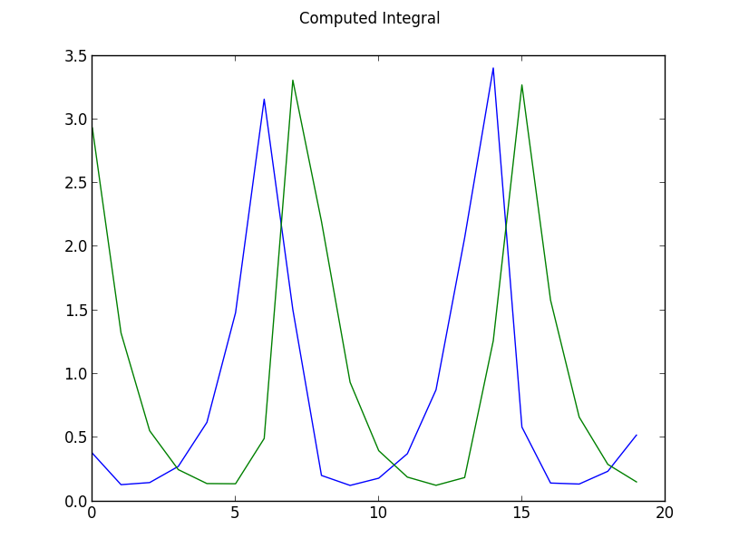
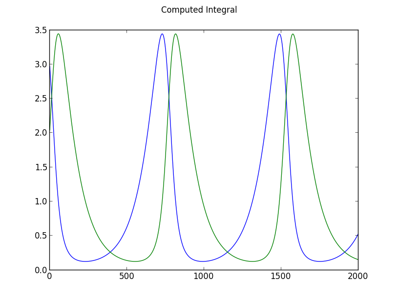
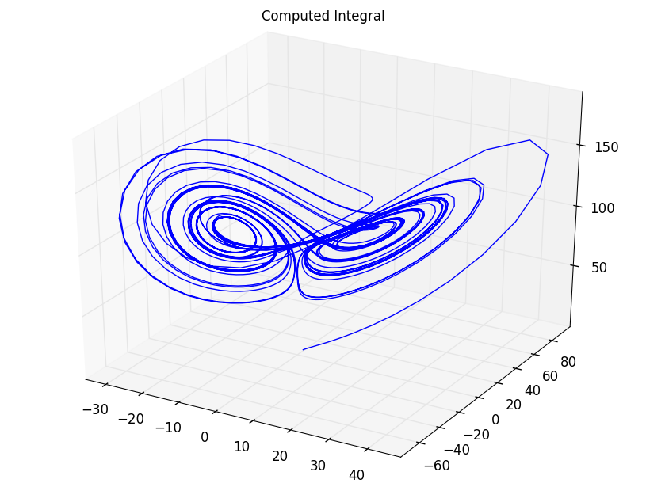
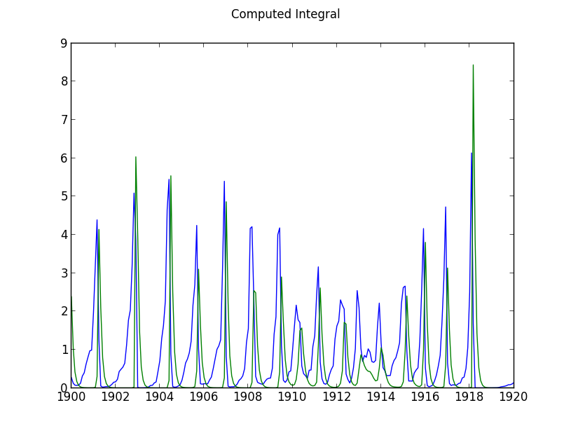
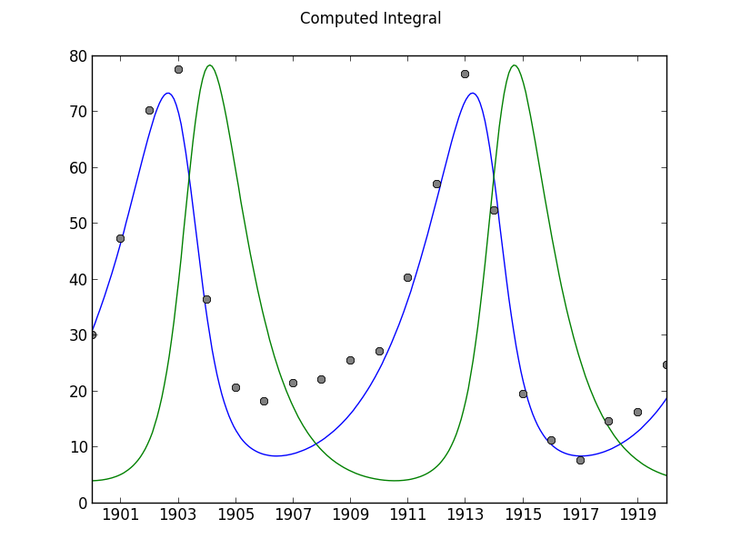
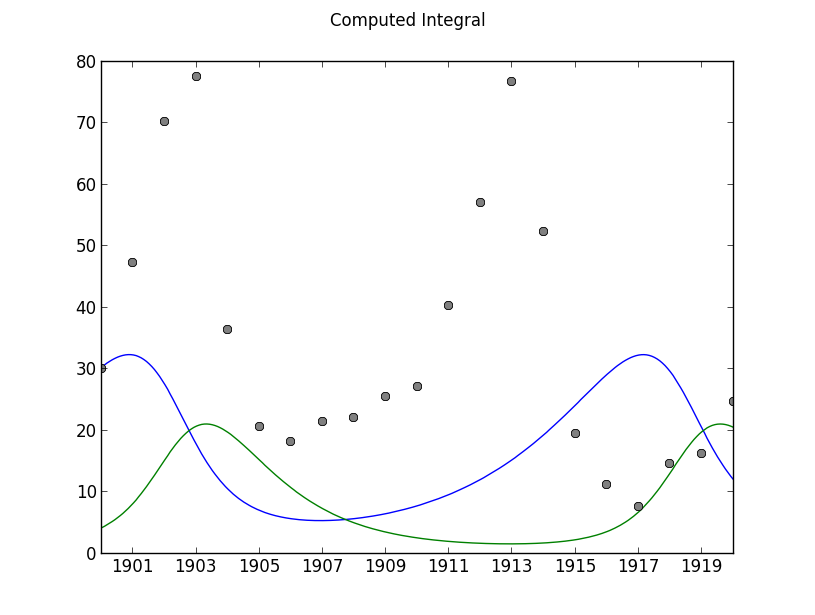
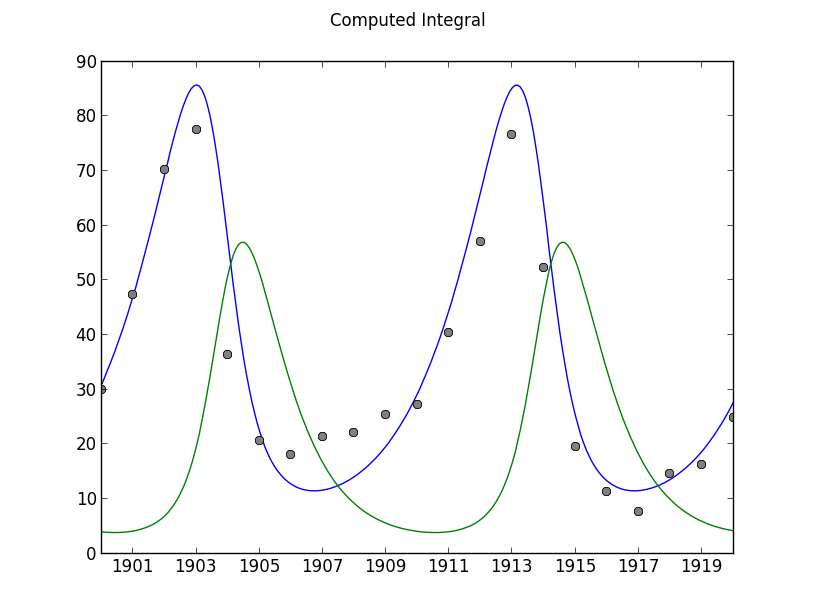

User Guide
----------

`EasyModler` is a package for calibration and 
simulation of Ordinary Differential Equations *ODEs*. 

**Features**

* ODEINT Wrapper        Intelligent non-invasive wrapper to `scipy.odeint <http://docs.scipy.org/doc/scipy/reference/generated/scipy.integrate.odeint.html>`_
* ODE Calibration       Auto-calibrate a series of ODEs to data
* TimeSeries Files      Handling of dtInput
* Model Validation      Validate using Goodness of Fit statistics
* Graphical Plotting    Basic plotting via matplotlib
* Graphical Interface   Coming in version 2.3

1. Simple Model Integration
~~~~~~~~~~~~~~~~~~~~~~~~~~~

The Lotka Volterra system is a simple model of predator-prey dynamics and consists of two coupled differentials.

.. [LVWikipedia] http://en.wikipedia.org/wiki/Lotka%E2%80%93Volterra_equation
.. [Volterra1928] Volterra, V. (1928). Variations and fluctuations of the number of individuals in animal species living together. J. Cons. Int. Explor. Mer, 3(1), 3-51.
.. [Lotka1922] Lotka, A. J. (1922). Contribution to the energetics of evolution. Proceedings of the National Academy of Sciences of the United States of America, 8(6), 147.

This is a simple example highlighting **EasyModler's** ability to integrate ODEs without complication! At a minimum to integrate we require:

1.  An defined ODE function

2.  A set of initial conditions as a list

3.  Number of times to run the integrator

- Import `EasyModeler 2`::

    >>> import emlib
   
Declare an ODE_INT function in your source code. This will be passed to :func:`scipy.integrate.odeint`.
The variables **dtinput** and **constants** are required, but will not be utilized in this example.

::
 
    def LV_int(t,initial,dtinput,constants):
        x = initial[0]
        y = initial[1]
        A = 1
        B = 1
        C = 1
        D = 1

        x_dot = (A * x) - (B * x *y)
        y_dot = (D * x * y) - (C * y) 

        return [x_dot, y_dot]

Pass the ODE function to :class:`emlib.Model`  as

::

    >>> LV = emlib.Model(LV_int)
    INFO -512- New Model(1): LV_int
    INFO -785- No algorithm supplied assuming vode/bfd O12 Nsteps3000 dt1
    DEBUG -799- Integrator:vode/bdf order:12 nsteps:3000 dt:1
    
- Now lets integrate our LV function for 20 timesteps!

    >>> LV.Integrate([1,1],maxdt=20)
    DEBUG -806- ODEINT Initials:32
    DEBUG -846- Ending in 20 runs
    DEBUG -868- Integration dT:0 of 20 Remaining:20
    DEBUG -880- Completed Integration, created np.array shape:(20, 2)
  
- The model output is stored in the :class:`emlib.Model` object as arrays *computedT* and *computed*

    >>> print LV.computed
    [[ 0.37758677  2.93256414]
    [ 0.13075395  1.32273451]
    [ 0.14707288  0.55433421]
    [ 0.27406944  0.24884565]
    ...

- Since we would much prefer a graph instead of a table of output lets use the built-in plotting function thanks to :func:`matplotlib`

    >>> LV.Draw()
    

The default behaviour of :class:`emlib.Model` is to assume a **dt** of 1 if not specified.  The **dt** or **DeltaTime** of the simulation is the change of time computed. 
For the LV model we may wish to integrate additional steps to increase the accuracy of the simulation.  Lets integrate again with a **dt** of .01 (100 steps)

    >>> LV.Integrate([3,2],maxdt=20, dt=.01)
    DEBUG -806- ODEINT Initials:32
    DEBUG -846- Ending in 2000 runs
    DEBUG -868- Integration dT:0 of 2000 Remaining:2000
    DEBUG -868- Integration dT:500 of 2000 Remaining:1500
    DEBUG -868- Integration dT:1000 of 2000 Remaining:1000
    DEBUG -868- Integration dT:1500 of 2000 Remaining:500
    DEBUG -880- Completed Integration, created np.array shape:(2000, 2)
    >>> LV.Draw()

2. Managing Model Coefficients
~~~~~~~~~~~~~~~~~~~~~~~~~~~~~~

The Lorenz system is a series of three differentials that were described by Edward Lorenz.  http://en.wikipedia.org/wiki/Lorenz_system This system is a great example of the power of coefficients!  
In this example we will delve into the EasyModeler :mod:`emlib` package to manage passing constants, or *coefficients* to our ODE function.

- Declare the Lorenz ODE function and create an :class:`emlib.Model` object.  However, we will now pass another list structure to our define which will become our coefficients::

    def Lorenz_int(t,initial,dtinput,constants):
        x = initial[0]
        y = initial[1]
        z = initial[2]
    
        sigma = constants.Val("Sigma")
        rho = constants.Val("Rho")
        beta = constants.Val("Beta")
        
        x_dot = sigma * (y - x)
        y_dot = x * (rho -z) - y
        z_dot = x * y - beta* z
        
        return [x_dot, y_dot, z_dot]
    
- Initialize the model::

    >>> LZ = emlib.Model(Lorenz_int)
    INFO -821- New Model(2): LV_int
    INFO -833- No algorithm supplied assuming vode/bfd O12 Nsteps3000 dt1
    DEBUG -847- Integrator:vode/bdf order:12 nsteps:3000 dt:1

- We now will create a :class:`emlib.Calibration` structure.  This will define our coefficients for Sigma, Rho, and Beta. For this example we want to keep Sigma and Beta constant, but allow Rho to change::

    >>> LZcalibration = emlib.Calibration()
    INFO -244- New Calibration instance: 1
    >>> LZcalibration.Add("Sigma",val=10,isconst=True)
    DEBUG -470- C:1 Sigma 10
    >>> LZcalibration.Add("Rho",val=99.96,min=10,max=100)
    DEBUG -470- C:2 Rho 99.96
    >>> LZcalibration.Add("Beta",val=2,isconst=True)
    DEBUG -470- C:3 Beta 2
    >>> LZcalibration.initial = [1,1,1]    

- Integrate the function for 30 timesteps with a **dT** of .1, then draw a graph::

   >>> LZ.Integrate(LZcalibration.initial,Calibration=LZcalibration,maxdt=30,dt=.01)
   >>> LZ.Draw()

.. image:: LZ1.png

- Since there are three dimensions to the LZ function we can also print a 3D graph using a supplied option to :func:`emlib.Model.Draw()`::

   >>> LZ.Draw(graph="3d")
   

.. note::  The graphing wrapper will only pass the first three computed differentials (x,y, and z) unless a specified order is passed.  For more information check the documentation for :func:`emlib.Model.Draw()`

3. Model Input
~~~~~~~~~~~~~~

In practice most models have boundary conditions and input to feed the equation set. Typically, this data is in the form of a table
where each moment of time has a value used by the model per **dT**.  The EasyModeler structure of interest is :class:`emlib.TimeSeries`.

- For this example we will add a food source term for the prey population of the Lotka Volterra model::

 
    def LV_int(t,initial,dtinput,constants):
        x = initial[0]
        y = initial[1]
        food = dtinput.Val("food")
        A = 1
        B = 1
        C = 1
        D = 1

        x_dot = (A * food * x) - (B * x *y)
        y_dot = (D * x * y) - (C * y) 

        return [x_dot, y_dot]

The timeseries that will be passed to the model is **LVinput.csv**.  This file is included in the `emlib` download package.  The file contains
a column of dates in **mm/dd/yyyy** format, and a column of random numbers from 0 - 1 with the heading **food**.

A snipet of this file looks like:

     +----------+---------+
     |DATE      | food    |
     +==========+=========+
     |01/01/1900| 0.330949|
     +----------+---------+   
     |02/01/1901|0.8346444|
     +----------+---------+  
     |03/01/1902|0.1472098|
     +----------+---------+ 

.. seealso:: For more help in defining and importing timeseries data see :class:`emlib.TimeSeries()`.  EasyModeler 2 supports files in CSV (**Comma Separated Values**) and SAS binary.

By importing a :class:`emlib.TimeSeries()` file EasyModeler will use the time component as our dTinput.  Each row of values will be passed to the integral per **dT**.  
Therfore, **dT[0] = 01/01/1900, dT[1] = 02/01/1900,...**  

	>>> LVmodel = emlib.Model(LV2_int)INFO -1026- New Model(1): LV2_int
	INFO -1038- No algorithm supplied assuming vode/bfd O12 Nsteps3000 dt1
	DEBUG -1052- Integrator:vode/bdf order:12 nsteps:3000 dt:1
	>>> LVtime = emlib.TimeSeries(filename="LVinput.csv")
	INFO -827- New TimeSeries instance: 1
	DEBUG -873- New INPUT table LVinput.csv['Date', 'food']
	DEBUG -884- Saved 241 rows and 1 columns
	DEBUG -886- Converted dates to contiguous np.array
	DEBUG -888- Converted input data to contiguous np.array
	>>> LVmodel.Integrate([3,2],TimeSeries=LVtime,dt=(1.0/12.0))
	DEBUG -1059- ODEINT Initials:32
	DEBUG -1098- Starting:1900-01-01 Ending:241
	DEBUG -1099- Passing DtInput:['food']
	DEBUG -1127- Integration dT:0 of 241 Remaining:241
	DEBUG -1139- Completed Integration, created np.array shape:(241, 2)
	>>> LVmodel.Draw()

4. Validating a Model to Observation Data
~~~~~~~~~~~~~~~~~~~~~~~~~~~~~~~~~~~~~~~~~

In this exercise we will use `EasyModeler` to compute validation statistics on a model to observational data.
The Lotka Volterra system was originally designed to describe the population data of Hares and Lynx.  This dataset is available from the emlib download package as **LVdata.csv**.

An important distinction of observation vs timeseries dtinput is observational files can contain replicate observations of a value at the same time.  

     +----------+---------+--------+
     |DATE      | Hares   | Lynx   |
     +==========+=========+========+ 
     |01/01/1900| 30      | 4      |
     +----------+---------+--------+    
     |01/01/1901| 47.2    | 6.1    |
     +----------+---------+--------+   
     |01/01/1902| 70.2    |    9.8 |
     +----------+---------+--------+  

.. seealso:: For more help in defining and importing timeseries data see :class:`emlib.Observation()`.  EasyModeler 2 supports files in CSV (**Comma Separated Values**) and SAS binary.

- Import the dataset:

    >>> LVhares = emlib.Observation("Hares",filename="LVdata.csv")
    DEBUG -671- ['Year', 'Hares', 'Lynx']
    DEBUG -673- New OBS for value:Hares COLMS:1 LVdata.csv
    INFO -690- Read file LVdata.csv 21 Observations for value Hares
    
- Now create a calibration class for the model.  The historical calibration for LV is a=.5,b=.02,c=.9,d=.03.
    
    >>> LVBEST = emlib.Calibration()
    INFO -295- New Calibration instance: 1
    >>> LVBEST.Add("A",val=.5)
    DEBUG -530- C:1 A 0.5
    >>> LVBEST.Add("B",val=.02)
    DEBUG -530- C:2 B 0.02
    >>> LVBEST.Add("C",val=.9)
    DEBUG -530- C:3 C 0.9
    >>> LVBEST.Add("D",val=.03)
    DEBUG -530- C:4 D 0.03
    >>> LVBEST.initial = [30.0,4.0]

- Lets define now the LV Model again, but with the advanced coefficient class::

    def LV3_int(t,initial,dtinput,constants):
        x = initial[0]
        y = initial[1]
        A = constants.Val("A")
        B = constants.Val("B")
        C = constants.Val("C")
        D = constants.Val("D")

        x_dot = (A * x) - (B * x *y)
        y_dot = (D * x * y) - (C * y) 

        return [x_dot, y_dot]

        
We also required a dtinput class, even though it is not used in the equations.  This is required because our model's **dT** is based in time.
a dtInput file will be used to feed information about time (our X axis in a timeseries graph) for validation and graphing purposes.  The file **LVinput.csv** is included in the emlib package::

    >>> LVtime = emlib.TimeSeries(filename="LVinput.csv")
    INFO -811- New TimeSeries instance: 1
    DEBUG -857- New INPUT table LVinput.csv['Date', 'food']
    DEBUG -868- Saved 241 rows and 1 columns
    DEBUG -870- Converted dates to contiguous np.array
    DEBUG -872- Converted input data to contiguous np.array

-  The model can now be executed and validated on the observation data.  The texbook historical calibration was also created with a dt of 1/12, so this must be passed to the integrator:

    >>> LVmodel = emlib.Model(LV2_int)
    INFO -1010- New Model(4): LV2_int
    INFO -1022- No algorithm supplied assuming vode/bfd O12 Nsteps3000 dt1
    >>> LVmodel.Integrate(LVBEST.initial,Calibration=LVBEST,TimeSeries=LVtime,dt=(1.0/12.0))
    DEBUG -1036- Integrator:vode/bdf order:12 nsteps:3000 dt:1
    DEBUG -1043- ODEINT Initials:30.04.0
    DEBUG -1082- Starting:1900-01-01 Ending:241
    DEBUG -1083- Passing DtInput:['food']
    DEBUG -1089- Passing Cs:['A', 'B', 'C', 'D']
    DEBUG -1107- Integration dT:0 of 241 Remaining:241
    DEBUG -1119- Completed Integration, created np.array shape:(241, 2)
    >>> LVmodel.Validate(LVob,graph=True)
    DEBUG -204- -STDEV	EXP	+STDEV	ISRANGE?
    DEBUG -176- 30.0	31.0685310906	30.0	0
    DEBUG -176- 47.2	46.9204691447	47.2	0
    DEBUG -176- 70.2	66.5107699854	70.2	0
    DEBUG -176- 77.4	69.6905765556	77.4	0
    DEBUG -176- 36.3	32.7807761087	36.3	0
    DEBUG -176- 20.6	12.9249681369	20.6	0
    DEBUG -176- 18.1	8.67261176202	18.1	0
    DEBUG -176- 21.4	8.84660667645	21.4	0
    DEBUG -176- 22.0	11.2981426728	22.0	0
    DEBUG -176- 25.4	16.0994275885	25.4	0
    DEBUG -176- 27.1	24.1072535354	27.1	0
    DEBUG -176- 40.3	36.6435721097	40.3	0
    DEBUG -176- 57.0	54.5833013399	57.0	0
    DEBUG -176- 76.6	72.175117603	76.6	0
    DEBUG -176- 52.3	57.3303708738	52.3	0
    DEBUG -176- 19.5	21.6690665469	19.5	0
    DEBUG -176- 11.2	10.3545405097	11.2	0
    DEBUG -176- 7.6	8.41953059301	7.6	0
    DEBUG -176- 14.6	9.56198487973	14.6	0
    DEBUG -176- 16.2	12.8777682017	16.2	0
    DEBUG -176- 24.7	18.809882218	24.7	0
    DEBUG -228- GFMODEL #21 MSE:27.3 RANGE%0 MSER:27.3 WMSE:27.3
    INFO -1299- New fitness object:1

The historical coefficients match the observed data at a Mean Square Error of 27.3.  

5. Calibrating a Model to Observation Data
~~~~~~~~~~~~~~~~~~~~~~~~~~~~~~~~~~~~~~~~~~

In this example we will use `EasyModeler` to compute the coefficents for the Lokta Volterra model. 
The ideal method to solve the LV system is analytically for the critical points.  However, for large scale models this is impractical, or impossible.  
Thus, we will numerically solve our coefficients to the dataset used in the previous example.

- For this example lets turn off the advanced debugging logger::

	>>> import logger
	>>> import emlib
	>>> emlib.emlog.setLevel(logging.INFO)

- Define the integral and import the observation file and timeseries file::

	def LV3_int(t,initial,dtinput,constants):
    		x = initial[0]
    		y = initial[1]
    		A = constants.Val("A")
    		B = constants.Val("B")
    		C = constants.Val("C")
    		D = constants.Val("D")

    		x_dot = (A * x) - (B * x *y)
    		y_dot = (D * x * y) - (C * y) 

    		return [x_dot, y_dot]

	>>> hares = emlib.Observation("Hares",filename="LVdata.csv")
	INFO -706- Read file LVdata.csv 21 Observations for value Hares
	>>> LVtime = emlib.TimeSeries(filename="LVinput.csv")
	INFO -827- New TimeSeries instance: 1
	>>> LVmodel = emlib.Model(LV3_int)
	INFO -1026- New Model(1): LV3_int
	INFO -1038- No algorithm supplied assuming vode/bfd O12 Nsteps3000 dt1
	>>> LVmodel = emlib.Model(LV3_int)

- Create the coefficient object.  For this example we need to create a minimum and maximum value for the valid region to test.  We also require a starting point, or *your best guess*:: 

	>>> LVtest = emlib.Calibration()
	>>> LVtest.Add("A",val=.3,min=.01,max=.7)
	>>> LVtest.Add("B",val=.04,min=.01,max=.07)
	>>> LVtest.Add("C",val=.6,min=.5,max=1.0)
	>>> LVtest.Add("D",val=.04,min=.01,max=.05)
	>>> LVtest.initial = [30.0,4.0]

This calibration test set is a very close approximation of the historical calibration set.  Running the integrator with this calibration we obtain a very weak fit to the data::

	>>> LVmodel.Integrate(LVtest.initial,Calibration=LVtest,TimeSeries=LVtime,dt=(1.0/12.0))
	>>> LVmodel.Validate(hares,graph=True)
	>>> LVmodel.fit.Print()
	GFMODEL #21 MSE:130.5 RANGE%0 MSER:130.5 WMSE:130.5 

.. note:: Why are we using a **dT** of (1/12)?  This model was calibrated to this dT instead of dT = 1.  

The tested coefficients validate poorly to the dataset at a Mean Square Error of 130.5.  

`EasyModeler` provides an interface to program and test multiple fitness algorithms on a model.  The default method is :func:`emlib.GF_BruteForceMSE()`.  
This method randomizes the coefficients from the supplied **min** to **max** and validates.  However, user supplied methods may also be passed to 
:class:`emlib.Model.Calibrate()`. The option **runs=** determines the maximum times to run the algorithm.

    >>> best = LVmodel.Calibrate(LVtest,hares,runs=500,TimeSeries=LVtime,dt=(1.0/12.0))
    ...
    >>> best.Print()
    >>> LVmodel.Integrate(LVtest.initial,Calibration=best,TimeSeries=LVtime,dt=(1.0/12.0))
    >>> LVmodel.Validate(hares,graph=True)
    >>> LVmodel.fit.Print()
    GFMODEL #21 MSE:29.6 RANGE%0 MSER:29.6 WMSE:29.6

Since each iteration of the function randomizes the coefficients actual numbers will vary.  
500 runs on a typical 2013 PC will take ~ 2 minutes and produce a fitness around 30 MSE.  
However, to start calibration from a **min** 0 to **max** of 1 may take several hours of runs.

.. note::  For a bonus exercise try to calibrate the Lotka model to both the Lynx and Hare populations.

6. Handling SAS Binary Files
~~~~~~~~~~~~~~~~~~~~~~~~~~~~

`SAS <http://www.sas.com/en_us/home.html>`_ is a statistical software system that is often used to analyze and store biological and ecological data.
As such, it is helpful to be able to interoperate between SAS binary files and Python.  `EasyModeler 2` uses `sas7bdat.py <https://pypi.python.org/pypi/sas7bdat>`_
to convert SAS binary files.

- To import a SAS file use the switch **fformat="sas"**::

    >>> sasob = emlib.Observation("salinity",filename="testsas.sas7bdat",fformat="sas")
    DEBUG -609- New OBS for value:salinity COLMS:15 testsas.sas7bdat
    INFO -645- Read file testsas.sas7bdat 44 Observations for value salinity

.. seealso:: See the autodoc pages for :class:`emlib.Observation` and :class:`emlib.TimeSeries` for help with importing files.
    
7. Logging and Debugging
~~~~~~~~~~~~~~~~~~~~~~~~

`EasyModeler 2` supports the Python `logging <https://docs.python.org/2/library/logging.html>`_ library.  
Logging messages are divided into hierarchical groups:

* ERROR
    * Hard error that should stop execution
* WARN
    * Warning that results may not be as intended, includes error messages.
* INFO
    * General information, includes warnings and errors.
* DEBUG
    * Verbose output that includes memory dumps for debugging purposes 

- To set the level of log messages::
    >>> import logging
    >>> import emlib
    >>> emlib.emlog.setLevel(logging.INFO)    
    
    
    